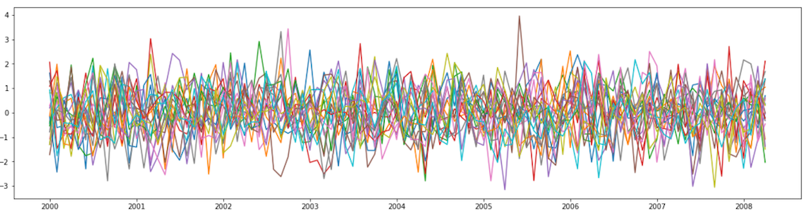
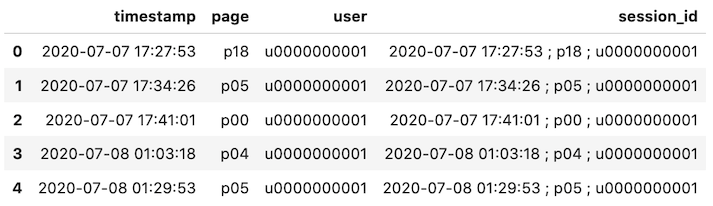
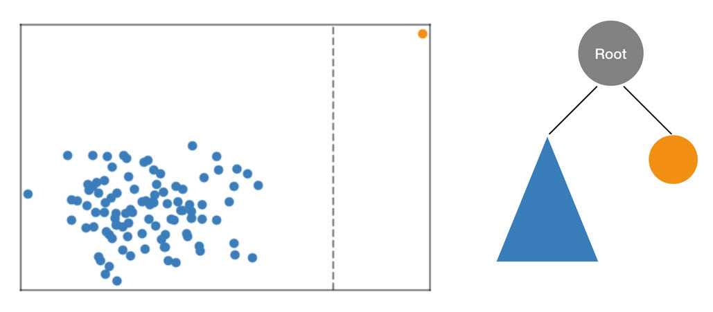
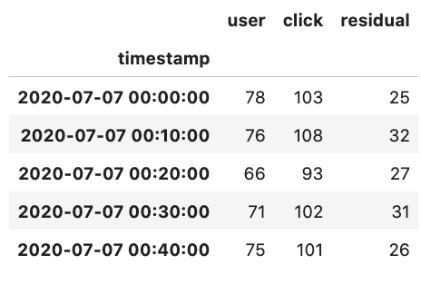
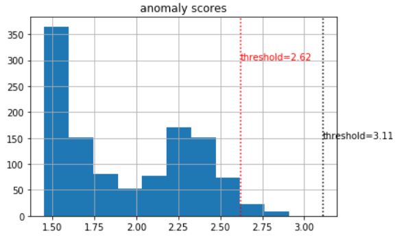
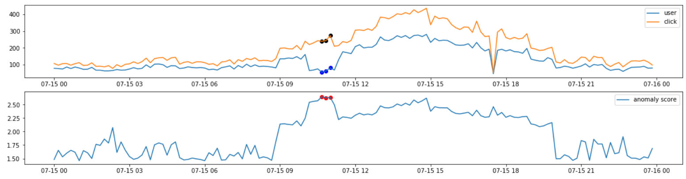
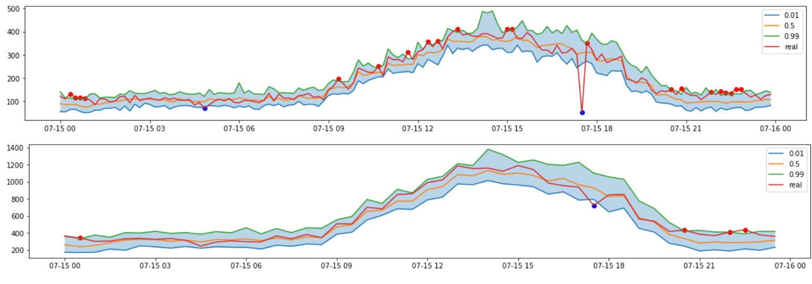
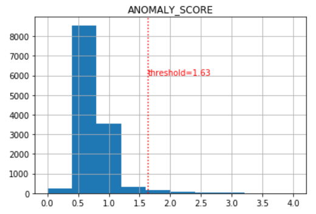
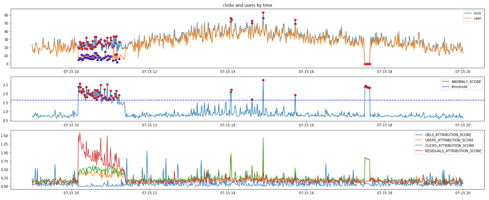

# Anomaly detection for click-stream data with SageMaker 

This is the fourth blog in a series of time series data analysis. In this blog, we will look at the anomaly detection of time series data analysis. Anomaly detection is used to find changes in patterns of data and have a wide range of applications, from detecting sudden changes in business metrics, detecting failure in complex systems, predictive maintenance, and even for monitoring data pipelines for unexpected changes. Some other types of events that can be detected include:
- Changes in the number of visitors or clickstreams on e-commerce websites
- Changes in the number of items sold or the sales in retail business
- Changes in usage of disk, memory or CPU in applications and systems infrastructure
- Changes in values such as temperature, vibration, current, torque from production machines and equipment

In many cases, human eyes can find irregular changes easily if the data is visualized through a graph. In real life, it is impossible for humans to visually check hundreds of thousands of data points generated simultaneously. Most of the monitoring systems are provided with an alarming feature with upper or lower limits, but they end up generating too many unnecessary alarms. 



Then, how can we automate this using math and algorithms? In this blog post, we will try to solve this problem by using two built-in algorithms provided by Amazon SageMaker. And we will look at Amazon Kinesis Analytics functions using same principle. 

### Clickstream dataset

We will use below clickstream dataset as an example. Dataset contains `page` that `user` clicked, and its `timestamp`. We can easily get this type of data by parsing the logs of the web services.



When using Amazon SageMaker, Data Lake will accelerate the cycle from development to deployment on production environment. AWS provides many convenient services such as Kinesis, Glue, and Athena for Data Lake and log collection. There are lots of reference architectures and guides for collecting clickstream logs. For example, we recommend to read [this blog post](https://aws.amazon.com/blogs/big-data/create-real-time-clickstream-sessions-and-run-analytics-with-amazon-kinesis-data-analytics-aws-glue-and-amazon-athena/).

### SageMaker Random Cut Forest

The first algorithm to look at is Amazon SageMaker Random Cut Forest (RCF). RCF is an unsupervised algorithm for detecting anomalous data points within a multi-dimensional dataset. The core idea of this algorithm is that irregular observations can be more easily found when using a decision tree to isolate all measurements.

Let's say the observations are distributed as follows and we are isolating these points with an arbitrary decision tree. Isolating outlier values marked in orange would be much easier than isolating values of one of the blue points which are distributed closely together. For each data point, RCF will return anomaly score to tell us the amount of irregularity. 

You may find more detailed explanation from here: [SageMaker document](https://docs.aws.amazon.com/sagemaker/latest/dg/rcf_how-it-works.html), or [youtube video](https://www.youtube.com/watch?v=yx1vf3uapX8))



While there are many applications of anomaly detection algorithms for one-dimensional time series data such as traffic volume analysis or sound volume spike detection, RCF is designed to work with arbitrary-dimensional input. Amazon SageMaker RCF scales well with respect to number of features, data set size, and number of instances.

In this scenario, we will transform our clickstream dataset into a new 3 dimensional time series. In the picture below, there are 'urls', 'users', and 'clicks' columns. 
- user : the number of users visited in 10 minutes
- click : the number of clicks that occurred for 10 minutes
- residual : the residual of clicks and users



If you transformed the clickstream into this format, training RCF model is now simple with just a few lines of code. In the example code below, we define SageMaker RandomCutForest object. We pass the resource type to be used and the path of training dataset as parameters. SageMaker will allocate one m4.xlarge resource for training, create a model using s3 training data, and automatically return the resources back when the job is complete.

```python
from sagemaker import RandomCutForest

session = sagemaker.Session()
execution_role = sagemaker.get_execution_role()
bucket = session.default_bucket()
prefix = 'rcf-clickstream'

rcf = RandomCutForest(role=execution_role,
                      train_instance_count=1,
                      train_instance_type='ml.m4.xlarge',
                      data_location='s3://{}/{}/'.format(bucket, prefix),
                      output_path='s3://{}/{}/output'.format(bucket, prefix),
                      num_samples_per_tree=512,
                      num_trees=100)

rcf.fit(rcf.record_set(train.to_numpy(), channel='train', encrypt=False))
```

Next, we will deploy the model for inference after the training job is finished. Since all the details regarding trained model are recorded in the RCF Estimator object declared in the training step, deployment process can be done simply by calling the rcf.deploy() method. When deploying, we pass another instance resource again. This structure allows you to designate appropriate resources for training or inference tasks.

```python
rcf_inference = rcf.deploy(
    initial_instance_count=1,
    instance_type='ml.m4.xlarge',
)
```

Now the endpoint will return the anomaly score. The larger the anomaly score, the more unusual it can be seen. At this point, we need to define a threshold for quantitative judgment. Since the RCF algorithm is unsupervised learning, label data is not required for training, but if there is some data, it can be very useful when setting the threshold. - You can determine the threshold with the highest accuracy or recall or F1 score by changing the threshold. If there is no label data at all and the algorithm has to determine the threshold with only a statistical value, you can apply 3 times of the standard deviation of the anomaly scores. However, if possible, it is advisable to determine this threshold based on past experience or expert judgment.


```python
results = rcf_inference.predict(train.to_numpy())
results_pd = pd.DataFrame(results['scores'])
results_pd.hist()
```



In our case, we will choose a threshold around 2.6.

Next, plot the timeseries with anomaly scores exceeding this threshold. In the figure below, you can see the `user` and `click` stream and anomalous points with red and blue points. 




Between 10:10 and 11:20 on July 15th, user information was incorrectly counted due to a program error. And during the time of 17:30 to 17:40 on July 15th, the entire site was down due to a system error.
Anomaly scores on both events were higher than the other observations. When we use a threshold of 2.6, only program error events could be detected. But if you set the threshold to a smaller value, you will also be able to detect system error events. 

From this example, we could see that the RCF finds anomalies based on dynamic variable changes, not simply fixed upper/lower limit values.
In subsequent scenarios, system error events will be detected through DeepAR, and RCF will analyze anomalous events with explanations again through Amazon Kinesis Analytics.


### SageMaker DeepAR

Most of the time series studies deal with predictions for future time series. These time series prediction algorithms can also be used to detect anomalies. The prediction of future time series is based on past patterns. This means that if the input time series is unusually different from the past pattern, it will deviate significantly from the predicted future time series.

The Amazon SageMaker DeepAR forecasting algorithm is a supervised learning algorithm for forecasting scalar (one-dimensional) time series using Recurrent Neural Networks (RNN). Unlike traditional algorithms such as ARIMA(autoregressive integrated moving average) or ETS(exponential smoothing), DeepAR can take into account additional features such as related time series or meta information of time series together. (This related timeseries feature is not covered in this blog. For an example of this feature, see [SageMaker official example](https://github.com/aws/amazon-sagemaker-examples/blob/master/introduction_to_amazon_algorithms/deepar_electricity/DeepAR-Electricity.ipynb).)

In this scenario, we will apply DeepAR by predicting the number of clicks in the future, using only the target time series to predict the number of clicks in 10 minutes.

In order to use DeepAR of SageMaker, we should change the record format. The records in your input files should contain the following fields:

- start : The start timestamp. A string with the format of YYYY-MM-DD HH:MM:SS.
- target : An array of floating-point values or integers that represent the time series. Here, we will use clickstream counts in 10 minutes for forecasting value.
- dynamic_feat (optional) : An array of arrays of floating-point values or integers that represents the vector of custom feature time series. We do not use daynamic_feat in this example..
- cat (optional) : An array of categorical features that can be used to encode the groups that the record belongs to. We do not use categorical values in this example.

```json
# example:
{"start": "2020-07-07 00:00:00", "target": [116, 112, 93, 117, 108, 107, 137, 127, 145, 133, 120, ...]}
```

For more information about input/output format of DeepAR, you can refer to this [developer document.](https://docs.aws.amazon.com/sagemaker/latest/dg/deepar.html#deepar-inputoutput) 

Once you have created this file, the rest of the process is the almost same as using other built-in algorithms. You need to upload this file to S3, define Estimator with algorithm and hyperparameters, and fit the model with the training data that we prepared. As hyperparameters, we set prediction length and context length as 24 hours. 

```python
import sagemaker

role = sagemaker.get_execution_role()       
train_s3 = sagemaker_session.upload_data(path='train.json', key_prefix=s3_prefix)
region = sagemaker_session.boto_region_name
image_name = sagemaker.image_uris.retrieve("forecasting-deepar",region)

# we predict for 24 hours (144 points) and use same context length with prediction length.
prediction_length = 24 * 6
context_length = 24 * 6 

estimator = sagemaker.estimator.Estimator(
    sagemaker_session=sagemaker_session,
    image_uri=image_name,
    role=role,
    instance_count=1,
    instance_type='ml.c4.2xlarge',
    base_job_name='deepar-clickstream'
)
hyperparameters = {
    "time_freq": '10min',
    "context_length": str(context_length),
    "prediction_length": str(prediction_length),
    "num_dynamic_feat" : "auto",
    "num_layers" : "1",
    "epochs": "400",
    "early_stopping_patience": "40",
    "mini_batch_size": "32",
    "learning_rate": "5E-4"
}
estimator.set_hyperparameters(**hyperparameters)
estimator.fit({"train": train_s3}, wait=True)
```

After the training, we will create an endpoint and run predictions just like RCF. This time, the model will return the distributed time series prediction for 0.01, 0.5, and 0.99 quantiles as we define them in request configuration. 

```python
from sagemaker.serializers import IdentitySerializer

predictor = estimator.deploy(
    initial_instance_count=1,
    instance_type='ml.m4.xlarge', 
    serializer=IdentitySerializer(content_type="application/json"),
    wait=True)

inf_data = {"instances":[test],
            "configuration": {"num_samples": 100, 
                              "output_types": ["quantiles", "samples"], 
                              "quantiles": ["0.01", "0.5", "0.99"]}
           }
prediction = predictor.predict(json.dumps(inf_data).encode('utf-8'))

```

Then, let's look at the prediction results in a graph. If the prediction results are correct, observations outside the prediction range can be considered outliers. In our result, most of the actual observations indicated by red line are in the range of 0.01 and 0.99 with blue and green quantile lines respectively. In our plot, the red and blue dots are detected as anomalous points outside the upper or lower prediction ranges. Our model seems to detect system error events well. The figure at the bottom shows the result of resampling the prediction results by 30 minutes. Depending on the business usecase, the forecasting unit may be different from the one used in the training. If you resample them with larger units of time, the prediction results will be smoother. This kind of manipulation can be used to prevent too much frequent noise alarms when setting the upper/lower monitoring limit with the prediction range of time series. 



From this example, we can see that the forecasting range can be used to set anomalous range for clickstream. In this example, we only detected system error events since we were using only click events that do not reflect the program error events. 


### Amazon Kinesis Analytics RCF

In addition, let's see how to perform anomaly detection using the statistical variance and deviation functions built in Amazon Kinesis Analytics. Kinesis Analytics is an AWS managed service that processes and analyzes real-time streaming data such as clickstreams. With Kinesis Data Analytics, you can process and analyze streaming data, aggregate or change streams, create dashboards, or generate real-time metrics. Data conversion in Kinesis Data Analytics provides an environment for converting streams using SQL or Apache Flink, and built-in functions. Among the built-in stream functions, there are RANDOM_CUT_FOREST and RANDOM_CUT_FOREST_WITH_EXPLATION functions to calculate anomaly score. In this article, we use the RANDOM_CUT_FOREST_WITH_EXPLATION function.

With the same dataset, we will send the data to AWS Kinesis Data Stream. AWS provides APIs, [Kinesis Producer Library (KPL)](https://docs.aws.amazon.com/streams/latest/dev/developing-producers-with-kpl.html), and [Amazon Kinesis Agent](https://docs.aws.amazon.com/streams/latest/dev/writing-with-agents.html) to support this task. The code below is an example of sending data using the [put_record](https://docs.aws.amazon.com/kinesis/latest/APIReference/API_PutRecord.html) API in AWS Python SDK.


```python
kinesis_client = boto3.client('kinesis')          # define client with aws python SDK
kinesis_data = json.dumps(make_kinesis_data(...)) # converts data to kinesis input format
kinesis_client.put_record(                        # send record to the Cloud
    StreamName=data_stream[0],
    Data=kinesis_data,
    PartitionKey=str(rnd)
)
```

Now you can create a Kinesis Analytics application that transforms the Kinesis Data Stream source that you created with above code. When writing transform code, you can call built-in functions. The code below is an example of executing the RANDOM_CUT_FOREST function with standard SQL. Just like calling internal functions with SQL for a Relational Database, you can simply call the RANDOM_CUT_FOREST_WITH_EXPLANATION function and calculate ANOMALY_SCORE and ANOMALY_EXPLANATION values from the stream.


```sql
CREATE OR REPLACE STREAM "TEMP_STREAM" (
   "TIMESTAMPS"          TIMESTAMP,
   "URLS"                INTEGER,
   "USERS"               INTEGER,
   "CLICKS"              INTEGER,
   "RESIDUALS"           INTEGER,
   "ANOMALY_SCORE"       DOUBLE,
   "ANOMALY_EXPLANATION" varchar(512));

CREATE OR REPLACE PUMP "STREAM_PUMP" AS INSERT INTO "TEMP_STREAM"
SELECT STREAM "TIMESTAMPS", "URLS", "USERS", "CLICKS", "RESIDUALS", "ANOMALY_SCORE", "ANOMALY_EXPLANATION" FROM
  TABLE(RANDOM_CUT_FOREST_WITH_EXPLANATION(
    CURSOR(SELECT STREAM * FROM "SOURCE_SQL_STREAM_001"), -- inputStream
    100, -- numberOfTrees
    256, -- subSampleSize
    4320, -- timeDecay (60m x 24h x 3d) (default 100000)
    1, -- shingleSize
    true
  )
);

```

The principle of the algorithm is the same as what we saw in SageMaker. Other than the RANDOM_CUT_FOREST, the RANDOM_CUT_FOREST_WITH_EXPLANATION function returns additional values related to interpretation. In addition to the anomaly score, the values returned by this function are as follows:

- Attribution score : A nonnegative number that indicates how much this column has contributed to the anomaly score of the record.
- Strength : A nonnegative number representing the strength of the directional recommendation.
- Directionality : This is either HIGH if the value of the column is above the recently observed trend or LOW if it’s below the trend. During the learning phase, this defaults to LOW.


Take a look at the values returned by Kinesis Analytics. (For the experiment, entire timeseries were sent to the Kinesis at once. I would take 9 days to test, if it were in a real environment, since the actual data occurred for 9 days.) Like when using SageMaker RCF, let's decide on a threshold to judge whether the observations are anomalous or not. The figure below shows the distribution of anomaly scores returned by Kinesis. This time, 3 times of standard deviation was used as a threshold. 




The graphs below show the anomaly scores and how each column attributed them. In the second graph, records with anomaly scores that exceed the blue dotted threshold line are marked as anomalies. The bottom graph shows the contribution of each column to the anomaly scores returned by RANDOM_CUT_FOREST_WITH_EXPLANATION. When program error events between 10:10 and 11:20 on July 15th are detected, the residual column in red line has the biggest effect. However, when detecting the system error events between 17:30 and 17:40 on July 15th, you can see that the clicks time series in green color mainly influenced it.  





### Conclusion

In this blog post, we looked at examples of how to use SageMaker built-in algorithms to detect anomalous points in time series. And we looked at how to calculate the anomaly scores from the real-time stream directly using the built-in function built in Kinesis Analytics as well. When we use built-in algorithms provided by SageMaker, we can develop the Machine Learning model with simple steps and deploy them to real application much easier. And, using Kinesis Analytics, you can store, transform, and process real-time streams without additional infrastructure management.

This is the final post of the series of time series analytics. We have covered 4 major scenarios to handle time series. We hope our posts help you get more insights to tackle various time series problems. You can find other posts below:

- Introduction to time series forecasting with SageMaker and Python by Eric Greene
- Benchmarking popular time series forecasting algorithms on electricity demand forecast by Yin Song
- Implementing Rapid and Cost-effective Demand Forecasting with AWS Solutions by Yoshiyuki Ito
